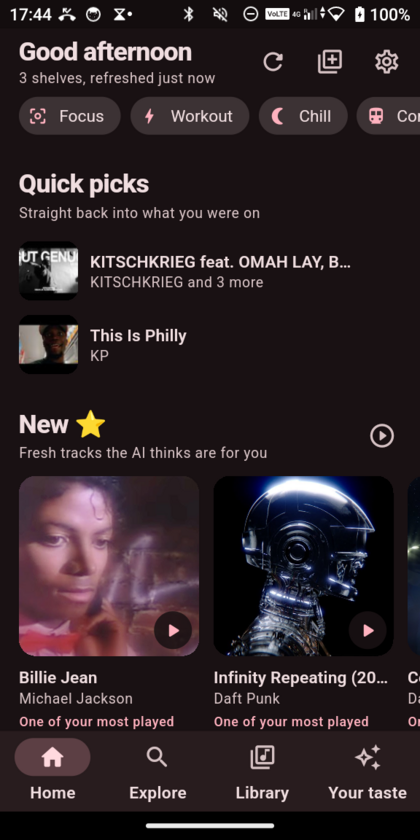
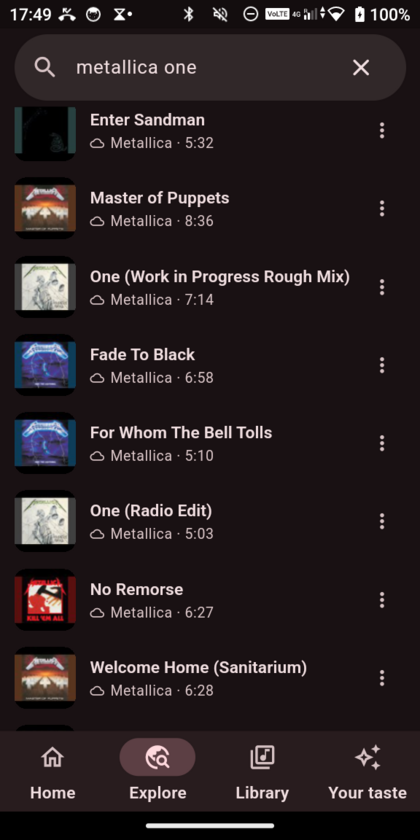
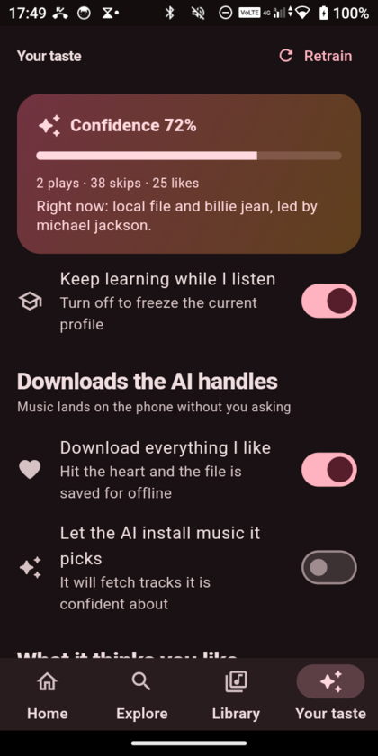
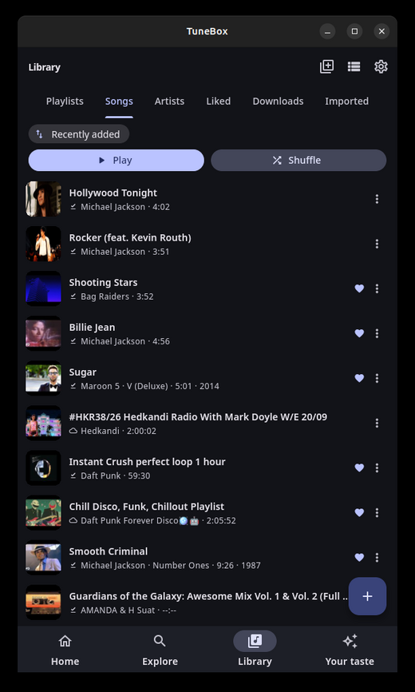

# TuneBox

A music player for Android and Linux, with a recommender that runs entirely on
your device. Music comes from YouTube and from your own files; what the app
learns about your taste never leaves the phone.

Built with Flutter, so one codebase runs on both.

<p align="center">
  
  
  
</p>

<p align="center">
  
</p>

## What it does

- **Plays YouTube** — search, stream, download for offline, background playback
  with proper media-notification and lock-screen controls.
- **Plays your own music** — point it at a folder and it reads the tags,
  embedded cover art and release years. Imported files and YouTube tracks live
  in one library.
- **Learns what you like.** Every finished play, skip, like and repeat updates a
  transparent scorer: per-artist, per-tag and per-decade weights, decayed over
  time. No black box — every recommendation can say *why* it is there
  ("One of your most played artists", "Liked, last played 8 months ago").
- **Builds shelves from that**: *On repeat*, *New ⭐*, *Old forgotten hits you
  liked*, *Because you played X*, *Barely touched*, *Your mix*. A song only ever
  appears on one shelf, so the home screen never repeats itself.
- **Train it directly** — a swipe-to-rate round, sliders for
  discovery / energy / recency / nostalgia, and per-artist "more of this" or
  "never again" overrides.
- **Auto-download** — optionally, anything you like is saved for offline, and
  the AI can fetch tracks it is confident about, inside a storage budget you set.
- **Moves between devices** — export your taste on one device, import it on
  another. Play counts merge, likes are OR'd.

Everything is local: a SQLite database and a folder of audio files. No account,
no server, no telemetry.

## Install

### Android (7.0 or newer)

Grab `TuneBox-<version>.apk` from
[Releases](../../releases) and open it on the phone. Android will warn that it
is not from the Play Store, because it is not — allow "install unknown apps"
for whatever you opened it with.

The APK is universal (arm64, arm32, x86_64).

### Linux (x86_64)

Download `TuneBox-<version>-linux-x64.tar.gz` from
[Releases](../../releases), extract it and run:

```bash
./install.sh
```

It installs into `$HOME` only — no root — and adds a menu entry, icons and a
`tunebox` command. Sound needs libmpv:

```bash
sudo apt install libmpv2     # Debian / Ubuntu
sudo dnf install mpv-libs    # Fedora
sudo pacman -S mpv           # Arch
```

Uninstall with `~/.local/share/tunebox/uninstall.sh`.

## Build it yourself

Needs Flutter 3.35+ and, for the phone, the Android SDK.

```bash
flutter pub get
flutter run -d linux                  # desktop
flutter build apk --release           # universal APK
flutter build linux --release         # desktop bundle
flutter test                          # 26 tests
flutter analyze
```

## How it works

```
lib/
  ai/ai_engine.dart              the scorer, the shelves, the explanations
  data/db/database.dart          drift (SQLite): songs, play events, affinities
  data/services/innertube.dart   YouTube + YouTube Music API client
  data/services/song_filter.dart tells songs apart from the rest of YouTube
  data/services/import_service.dart  local files, tags, embedded artwork
  playback/audio_handler.dart    queue, just_audio + audio_service
  playback/stream_proxy.dart     loopback server between player and YouTube
  features/                      home, search, library, player, taste, settings
```

Two things worth knowing if you read the code:

**Streaming.** YouTube's Android and iOS clients cap third-party streams at
about a megabyte, and its web clients hand out no stream URLs at all. The
visionOS client still serves whole files, so that is what `innertube.dart`
asks as. Media URLs then need a *bounded* Range header on every request, which
is what the loopback proxy in `stream_proxy.dart` guarantees.

**Search goes to YouTube Music, not YouTube.** Plain YouTube search answers a
music query with MMA livestreams and basketball games; `music.youtube.com`
only indexes music. Plain YouTube remains a fallback, and everything it returns
is filtered by `song_filter.dart`.

## Credits

The interface follows [OpenTune](https://github.com/Arturo254/OpenTune) and
[InnerTune](https://github.com/z-huang/InnerTune); the streaming approach
follows [yt-dlp](https://github.com/yt-dlp/yt-dlp).

A personal project, not affiliated with YouTube or Google.
